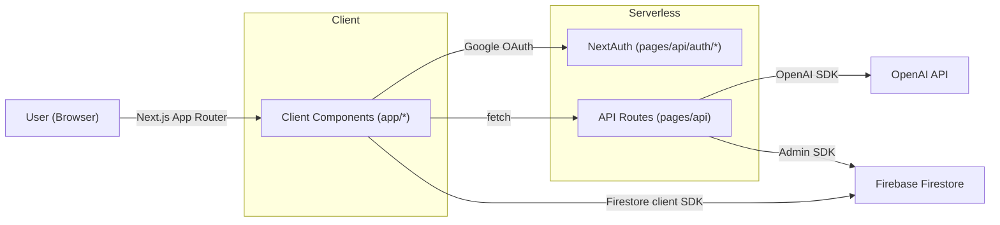

<div align="center">

# ChatGPT Clone — Next.js 13 (App Router) + TypeScript + Firebase + NextAuth + OpenAI

[](https://www.typescriptlang.org/)
[](https://nextjs.org/)
[](https://tailwindcss.com/)
[](https://firebase.google.com/)
[](https://next-auth.js.org/)
[](https://platform.openai.com/)
[](https://swr.vercel.app/)
[](https://vercel.com/)

Build a full‑stack AI chat application with Google OAuth, model selection, persisted chat history, and serverless API routes powered by OpenAI.

</div>

## Overview

This project is a production‑ready ChatGPT‑style web app built with Next.js 13 App Router and TypeScript. Users authenticate with Google via NextAuth, create multiple chat threads, and converse with OpenAI models. Messages are persisted in Firebase Firestore and rendered in real time. Model selection is powered by a serverless endpoint that queries OpenAI’s available models.

### Highlights

- Google OAuth via NextAuth (session bridged into App Router)
- Real‑time chat threads stored in Firestore (react‑firebase‑hooks)
- OpenAI text completions (default `text-davinci-003`) with tunable parameters
- Model dropdown backed by `/api/models`
- Toast notifications (react-hot-toast)
- Responsive UI built with Tailwind CSS and Heroicons
- TypeScript throughout with shared `Message` typing

## Tech Stack

- Frontend: Next.js 13 (App Router), React 18, TypeScript, Tailwind CSS, Heroicons
- Auth: NextAuth.js (Google provider)
- Data: Firebase Firestore (client SDK + Admin SDK)
- AI: OpenAI API (Completions)
- Data Fetching: SWR
- Hosting: Vercel (recommended)

## Architecture



### Data Model (Firestore)

```
users/{email}/chats/{chatId}/messages/{messageId}

Message = {
  text: string,
  createdAt: Timestamp,
  user: { _id: string, name: string, avatar: string }
}
```

## Project Structure

```
app/
  layout.tsx               # App Router layout: session + shell (sidebar, main)
  page.tsx                 # Landing (examples, capabilities, limitations)
  chat/[id]/page.tsx       # Chat thread (messages + input)
components/
  Chat.tsx                 # Stream messages for a chat
  ChatInput.tsx            # Prompt input + submit (calls /api/askQuestion)
  SideBar.tsx              # Chat list, model selector, sign out
  ModelSelection.tsx       # SWR + react-select fed by /api/models
  Message.tsx              # Message bubble
  Login.tsx                # Google sign‑in screen
  SessionProvider.tsx      # NextAuth provider wrapper
  ClientProvider.tsx       # React Hot Toast
lib/
  chatgpt.ts               # OpenAI SDK configuration
  queryApi.ts              # OpenAI completion request helper
pages/
  _app.tsx                 # Global styles (legacy Pages entry)
  api/
    askQuestion.ts         # POST → OpenAI + persist assistant message
    models.ts              # GET → list OpenAI models for selector
    auth/[...nextauth].ts  # NextAuth Google provider setup
firebase.ts                # Client Firestore init
firebaseAdmin.ts           # Admin SDK (server‑only)
typings.d.ts               # Message interface
styles/tailwind, globals   # Tailwind setup
```

## Getting Started

### 1) Prerequisites

- Node.js 18+
- Yarn or npm
- Firebase project with Firestore enabled
- Google OAuth credentials (OAuth Consent Screen + Web Client)
- OpenAI API key

### 2) Environment Variables

Create a `.env.local` in the project root:

```
OPENAI_API_KEY=sk-...

# NextAuth
GOOGLE_ID=your-google-oauth-client-id
GOOGLE_SECRET=your-google-oauth-client-secret
NEXTAUTH_URL=http://localhost:3000
NEXTAUTH_SECRET=your-random-string

# Firebase Admin (JSON string of your service account)
FIREBASE_SERVICE_ACCOUNT_KEY={"type":"service_account",...}
```

Notes:

- `firebase.ts` currently holds client config inline. For production, move it to environment variables and never commit secrets.
- The Admin SDK reads `FIREBASE_SERVICE_ACCOUNT_KEY` from the environment. Do not commit real service account files.

### 3) Install & Run

```bash
# install
yarn
# or: npm install

# dev
yarn dev
# open http://localhost:3000
```

## API

### POST /api/askQuestion

Request body:

```json
{
  "prompt": "Explain the difference between a dog and a cat",
  "chatId": "<firestore-chat-id>",
  "model": "text-davinci-003",
  "session": {
    /* next-auth session (used for attribution) */
  }
}
```

Behavior:

- Calls OpenAI Completions with tuned parameters (temperature, penalties)
- Persists assistant response to `users/{email}/chats/{chatId}/messages`
- Returns `{ "answer": string }`

### GET /api/models

Returns a list of available model ids suitable for a select dropdown:

```json
{
  "modelOptions": [{ "value": "text-davinci-003", "label": "text-davinci-003" }, ...]
}
```

## Key Implementation Details

- Authentication: Google provider via NextAuth (`pages/api/auth/[...nextauth].ts`)
- Session integration: `getServerSession` in `app/layout.tsx`
- Real‑time reads: `react-firebase-hooks` with Firestore queries
- Model selector: SWR + `react-select` backed by `/api/models`
- Notifications: `react-hot-toast` via `ClientProvider`
- Styling: Tailwind CSS utility classes

## Deployment (Vercel)

1. Push your repo to GitHub/GitLab/Bitbucket
2. Import the project on Vercel
3. Add the environment variables from above in the Vercel dashboard
4. Deploy

## Security & Privacy

- Keep secrets in environment variables, not in source control
- Ensure service account keys are stored securely (consider base64‑encoding JSON if your platform requires it)
- Restrict Firestore security rules appropriately for your use case

## Skills Demonstrated (AI‑Readable)

- Next.js 13 App Router, React 18, TypeScript
- Authentication with NextAuth (OAuth, session management)
- Firebase (Firestore client + Admin SDK), real‑time data
- OpenAI API integration (serverless API routes, SDK usage)
- State/data fetching with SWR; UI with Tailwind CSS and Heroicons
- Full‑stack architecture, environment configuration, deployment to Vercel

## Roadmap

- Switch to Chat Completions / GPT‑3.5+ with streamed responses
- Migrate client Firebase config to environment variables
- Add unit/integration tests and CI
- Add message editing and regeneration, citations, and system prompts

---

This repository is intended as a portfolio‑grade example of a modern, full‑stack AI application.
